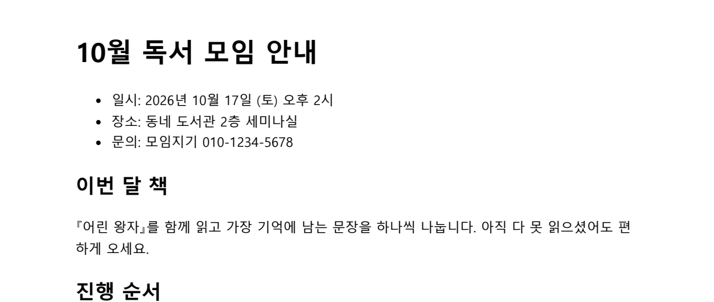
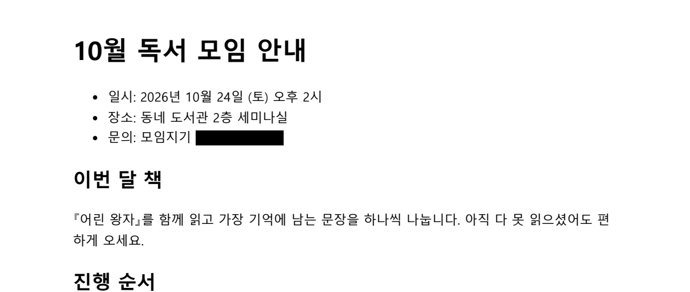

# Retext PDF

> Formerly named EDITOR_KIM (renamed in v4.0.0). The repository moved to `kindsusu/retext-pdf`; GitHub redirects the old URL.

[](https://github.com/kindsusu/retext-pdf/releases/latest) [](https://github.com/kindsusu/retext-pdf/actions/workflows/ci.yml)  [](LICENSE)


A local Windows editor that changes PDF text objects directly and removes sensitive text for real, with Markdown editing on the side. Everything runs on your PC — your documents never leave it.

[한국어](README.ko.md) · [Plan](PLAN.md) · [Releases](https://github.com/kindsusu/retext-pdf/releases)

## Download

**Recommended: [get it from the Microsoft Store](https://apps.microsoft.com/detail/9MXQD6ZHX6HH)** — the package is signed by Microsoft, so it installs without a SmartScreen warning, and the Store keeps it up to date.

To download an installer directly, use **[Releases](https://github.com/kindsusu/retext-pdf/releases/latest)**.

| File | Use it when |
|---|---|
| `Retext-PDF-<version>-setup.exe` | You want a normal install (per user, no admin rights). Adds Retext PDF to the PDF "Open with" list and a Start-menu shortcut. |
| `Retext-PDF-<version>-portable.exe` | You want to run it from a folder or USB stick without installing. |

Requirements: Windows 10 or 11 (x64), about 400 MB of disk space. No account or internet connection is needed.

**First launch and SmartScreen (Releases installers only).** The Releases builds are not code-signed, so Windows may show "Windows protected your PC". Check that the file came from this repository's Releases page, then choose **More info → Run anyway**. Alternatively, right-click the downloaded file → **Properties** → tick **Unblock** → OK. Do not turn off Microsoft Defender to get past the warning.

## What's new in 3.0

- Redaction also removes text that a PDF draws twice in the same place (bold or shadow effects), which previously reappeared after saving.
- Editing a line no longer bloats the file (a 1.4 MB page edit could grow to 27 MB) and no longer exhausts memory on very large PDFs.
- A failed edit keeps your typed text and leaves the document and undo history untouched; unsaved edits are kept if another program changes the file on disk.
- Filled-in e-contract fields (numbers, addresses) are edited as one box instead of one character at a time.
- Large Korean Markdown files save without corrupted characters; Markdown links open in your browser instead of replacing the app window.

Full notes: [v3.0.0 release](https://github.com/kindsusu/retext-pdf/releases/tag/v3.0.0).

## Features

- Direct PDF text-object editing with the original embedded font, falling back to a subset Malgun Gothic for missing glyphs
- Redaction that removes the selected characters from the PDF and verifies the removal by re-extracting text; a search hit can also be masked with "mask the whole line"
- Full-text search (Ctrl+F) across every page with prev/next navigation, a match counter, match-case, and highlighted results
- Page tools: extract/delete pages, rotate a page or a thumbnail 90° at a time, drag-reorder thumbnails, split into N-page files, merge PDFs, export pages as PNG/JPEG, insert an image, and reduce file size by downsampling (single document or several files at once, without opening them)
- A status bar with the current page / total pages, a page-number jump box, and a zoom slider; a sidebar with 파일/페이지 tabs (open files and page thumbnails)
- An empty state with quick tools (merge, reduce several files' size, export images) and a full-window drag-and-drop overlay when no document is open
- Open PDFs straight from a browser or mail client via the Windows "Open with" association (temp-file downloads show a banner and save with "Save As")
- Undo/redo, multi-line editing, fit-to-width, and move — one edit is always one undo step, even when alignment is kept
- Safe editing: every line edit is applied, saved, reopened, and checked before it replaces the document; anything that fails is rolled back
- A progress dialog with a cancel button for long document tools (size reduction, export, split, merge, page cleanup), which restores the document or reports how many files were saved when cancelled
- An undo toast after page deletion, size reduction, rotation, or reordering, separate from the status-bar flash message
- Markdown editing with a sanitized live preview

| Before | After |
|---|---|
|  |  |

## Run from source

```bash
git clone https://github.com/kindsusu/retext-pdf.git
cd retext-pdf
npm install
npm start
```

Double-clicking `run-retext-pdf.bat` runs the same source without opening a terminal. Use `npm run serve` for the browser-only mode at <http://localhost:4747>; native file dialogs and PNG insertion are Electron-only there.

## PDF editing


Click a line, edit it, and press Enter to confirm. PDFs exported from Excel, Hangul or Chromium split one line into many text objects (per font run, sometimes per character); fragments that share a baseline and sit next to each other are merged into one editable box, while table cells stay separate (gap size plus a vertical-rule check). Text keeps its original embedded font where possible; characters missing from that font fall back to Malgun Gothic. The **폰트 맞추기** (font match) dialog opens for image-backed hidden text or a text box where you've already chosen a font — pick an installed font or import a TTF, preview the result, and apply with undo support. When the original font cannot be reused (for example, text drawn as an image), the dialog says so and you choose the closest-looking font yourself; only plain TTF fonts are supported, not OTF or variable fonts.


Text redaction removes the selected characters from the PDF object, adds a covering rectangle, and re-extracts the page text to confirm the removal. Text inside a scanned image can only be visually covered, not removed.

## Privacy and safety

- Documents never leave your PC. There is no account, cloud service, or AI connection; the built-in server listens on `127.0.0.1` only and rejects requests from other sites (host and origin checks).
- Markdown links open in your default browser, and remote images in Markdown are not loaded automatically.
- Redaction removes characters from the file itself, then re-extracts the page text to confirm; scanned images can only be covered.

## PDF tools

The toolbar's **페이지** and **문서** groups hold these document-level tools (all undoable except image export and split, which write new files and leave the open document untouched):

- **페이지 정리…** — extract/delete pages via checkbox thumbnails or a `1,3-5` range
- **↺ / ↻** — rotate the current page 90°; a page thumbnail's right-click menu offers the same for that one page, plus "새 파일로 저장…" (save that single page as a new PDF)
- Drag a thumbnail in the sidebar's **페이지** tab to reorder pages
- **분할…** — split the document into N-page files in a chosen folder
- **병합…** — merge several PDFs in a chosen order
- **이미지로 내보내기…** — export pages as PNG/JPEG at 96–300 dpi into a folder
- **이미지 삽입** — insert a JPEG/PNG; drag to move, handle to resize
- **용량 줄이기…** — downsample images above a dpi threshold, re-encode as JPEG, optional target size (transparent images skipped); the empty-state **여러 파일 용량 줄이기…** quick tool runs the same on several PDF files at once, without opening them, and writes `<name>-축소.pdf` next to each

Rotated pages keep their text, redaction, search, and drag-to-move overlays aligned — the UI converts between the PDF's unrotated coordinate space and the rotated on-screen layout for every box and highlight.

## Shortcuts

| Key | Action |
|---|---|
| `Ctrl+S` | Save |
| `Ctrl+Shift+S` | Save as |
| `Ctrl+Z` / `Ctrl+Y` | Undo / redo |
| `Ctrl+F` | Open the search bar |
| `Enter` / `Shift+Enter` (in the search box) | Next / previous match |
| `Esc` (in the search box) | Close the search bar |
| `PageUp` / `PageDown` / `Home` / `End` | Jump a page / to the first / last page |
| `Ctrl` + mouse wheel | Zoom the PDF around the cursor |
| `Ctrl+=` / `Ctrl+-` / `Ctrl+0` | Zoom in / out / fit page width |
| `F12` | Developer tools |

## FAQ

**Can the SmartScreen warning be removed?** The [Microsoft Store version](https://apps.microsoft.com/detail/9MXQD6ZHX6HH) is signed by Microsoft and shows no warning. The Releases installers are unsigned, so use "More info → Run anyway" or "Unblock" as described above.

**Some characters changed to Malgun Gothic after editing.** A PDF usually embeds only the characters it already uses. New characters that the embedded font lacks are drawn with Malgun Gothic. Use **폰트 맞추기** to pick a closer installed or TTF font.

**An edit was refused with a reason.** Lines containing math symbols or emoji that no available font can draw, and a few PDFs whose fonts store a different character than the one typed, are refused instead of saving wrong text.

**Password-protected PDFs** cannot be opened. Remove the password in the program that set it, then open the file again.

## Development

```bash
npm test
npm audit
npm run dist   # release builds
```

```text
app/                    UI, local server, PDF engine, tests
assets/                 README artwork and diagrams
tools/                  fixture and icon regeneration tools
workspace/              fictional test documents
```

## Limits

- Targets Windows 10+ and is verified on Windows 11.
- Does not directly edit text inside scanned images.
- Complex CJK ligatures, vertical text, and unusual fonts may require fallback.
- Password-protected PDFs are not supported.
- Review the license before business or commercial use.

## License

Free for personal, non-commercial use. Company, workplace, or commercial use requires prior written permission from the copyright holder. See [LICENSE](LICENSE).
